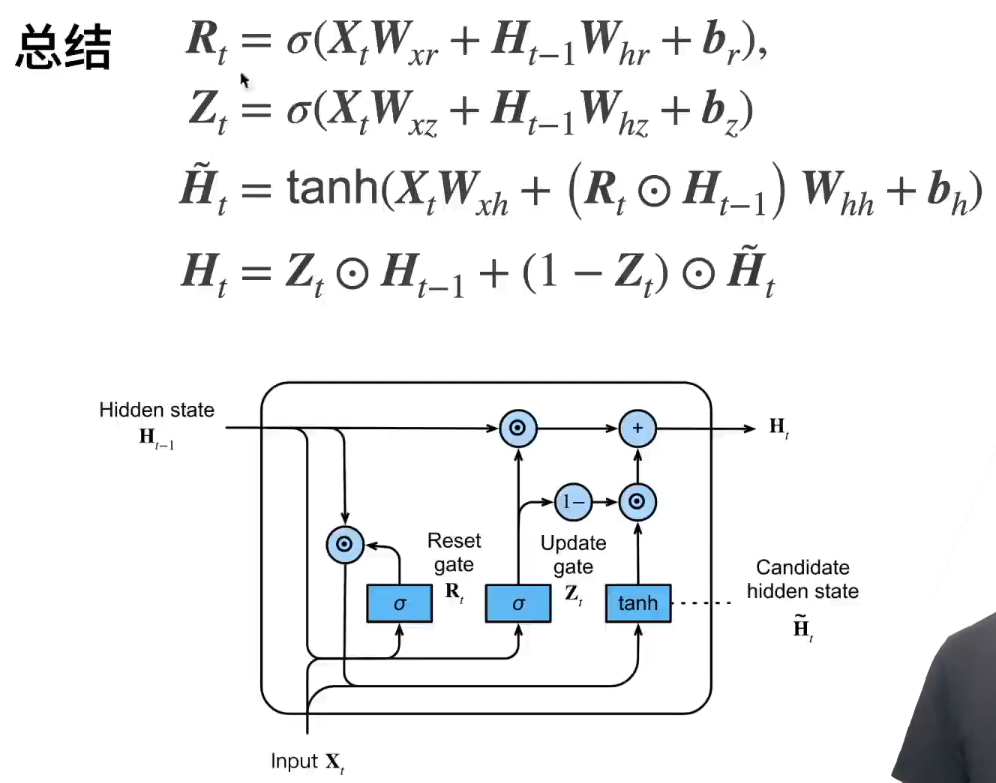

### GRU——用‘门’来实现“哪些很重要，那些不重要”

- Z，更新门（update gate）实现关注的机制，即哪些重要
Z等于1，则H_t=H_t-1，就跳过了X_t，保留全部的H
- R，重置门（reset gate）实现遗忘的机制，即哪些不重要 
R等于0， 实际上能够做到~H_t=X_t，就会全部遗忘以前的H

### LSTM

- 忘记门：将值朝0减少
- 输入门：决定是不是忽略掉输入数据
- 输出门：决定是不是使用隐状态
#### new memory cell
这一步和GRU中的new memory类似，输出的向量都是对新的输入 和上一时刻的hidden state 的总结。
#### Input gate
负责决定输入的 信息是否值得保存。
#### Forget gate
负责决定past memory cell 对 的重要性。
#### final memory cell
由 和 相加得到，权重分别由 Forget gate 和Input gate 决定
#### Output gate
这个门是GRU没有的。它负责决定 中的哪些部分应该传递给hidden state

