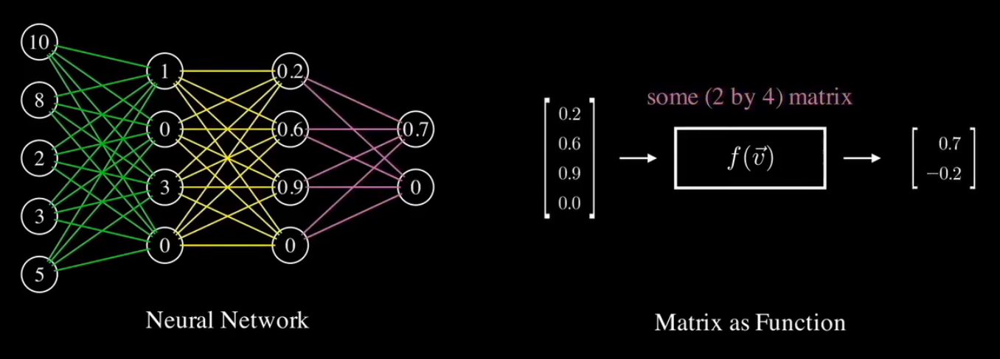

## 矩阵(计算的目的在于洞察，而不是数字)
### 矩阵的解释权是使用者的
1. 对于学习线性代数的学生来说，矩阵只是解决方程系统的一种工具。

2. 对于学习概率论的学生来说，矩阵是马尔可夫过程的最佳表达形式

3. 对于数据科学家，矩阵就是表的一种形式，一种数据容器，方便进行数据处理。

4. 对于深度学习的人，矩阵就是特征提取过程，输入一组特征，输出一组特征。

5. 对于计算机图形学的学生来说，矩阵是图形直观的旋转、伸缩、投影。

### 矩阵特性
- 对称矩阵的特征向量是正交的
- 正交矩阵的列向量长度为一，且列向量之间相互正交————正交矩阵是旋转矩阵
- 正交矩阵的逆，是正交矩阵的转置
- 矩阵乘以矩阵的转置，会得到一个对称矩阵

### 谱分解
S是对称向量的时候可以用
Q是正交矩阵
$ S = Q \lambda Q^{T} $,Q是S的特征向量，$\lambda$是S的特征值的对角矩阵，变化如下：
S可以理解为，先把张量旋转到标准积的位置$Q^{T}$，然后伸缩变换$\lambda$，然后再旋转到特征向量的位置$Q$

### SVD（是矩阵理论的集大成者）
**SVD能够将任何矩阵分解为三个矩阵$A=U\sum V^T$**

$U=AA^T即(S_L)$$V=A^TA即(S_R)$
$AA^T$是$S_L$，是半正定矩阵，所有特征值都是非负的，其特征向量被称为A的左奇异向量。
$A^TA$是$S_R$，是半正定矩阵，所有特征值都是非负的，其特征向量被称为A的右奇异向量
对且两个矩阵的特征值相等（n>m时，前m个特征值相等）

### SVD与PCA的关系
#### SVD用于PCA降维
用PCA降维需要找到样本协方差矩阵 $X^TX$ 的最大的d个特征向量，然后用这最大的d个特征向量张成的矩阵来做低维投影降维。可以看出，在这个过程中需要先求出协方差矩阵 $X^TX$ ，当样本数多样本特征数也多的时候，这个计算量是很大的
回顾上面SVD的计算过程，我们可以发现：求 $X^TX$ 的d个最大的特征值对应的特征向量张成的矩阵，其实相当于对 $X^TX$ 进行奇异值分解得到右奇异矩阵 $V$ 
SVD有个好处，有一些SVD的实现算法可以不求先求出协方差矩阵 $X^TX$ ，也能求出我们的右奇异矩 $V$ 。也就是说，我们的PCA算法可以不用做特征分解，而是做SVD来完成，这个方法在样本量很大的时候很有效
实际上，scikit-learn的PCA算法的背后真正的实现就是用的SVD，而不是我们我们认为的暴力特征分解
***
假设我们的样本是m×n的矩阵X，如果我们通过SVD找到了矩阵 $XX^T$ 最大的d个特征向量张成的m×d维矩阵 $U$ ，则我们如果进行如下处理：

 $X'_{d \times n} = U_{d \times m}^TX_{m \times n}$ 

可以得到一个d×n的矩阵 $X'$ ，这个矩阵和我们原来的m×n维样本矩阵X相比，行数从m减到了d，可见对行数进行了压缩。也就是说，**左奇异矩阵可以用于行数的压缩。相对的，右奇异矩阵可以用于列数即特征维度的压缩，也就是我们的PCA降维。**
***
假设令 $X$ 为要降维的矩阵，且**假设这个矩阵是中心化的.**

对于PCA来说，要求一个协方差矩阵 $C$ ，则 $C=X^TX/(n-1)$ ,这是一个对称阵且可以被对角化，即

$C=VLV^T$      (Eq.1)

其中 $V$ 是特征向量， $L $ 是对角矩阵中间数值为 ${\lambda _1}，{\lambda _2}，{\lambda _3}，....$ ， $XV$ 就是降维后的向量，降维多少看你取前多少个特征向量了。

对于SVD来说，就是要对矩阵 $X$ 进行如下：

$X=USV^T$     (Eq.2)

其中 $U$ 为左奇异向量(正交)， $S$ 为对角矩阵中间数值为 $s_1,s_2,s_3,...$ ， $V$ 为右奇异向量(正交)。

联合上面两个式子，则有

$C = VS{U^T}US{V^T}/(n - 1) = V\frac{{{S^2}}}{{n - 1}}{V^T}$   (Eq.3)

比对式子1可以看到 ${\lambda _i} = {s^2}_i/(n - 1)$ ,且有 $XV = US{V^T}V = US$ 。

总结一波：

1. 两者都是矩阵分解的技术，一个直接分解SVD，一个是对协方差矩阵操作后分解PCA
2. 奇异值和特征向量存在关系，即有 ${\lambda _i} = {s^2}_i/(n - 1)$ SVD可以获取另一个方向上的主成分，而PCA只能获得单个方向上的主成分，PCA只与SVD的右奇异向量的压缩效果相同
3. 通过SVD可以得到PCA相同的结果，但是SVD通常比直接使用PCA更稳定。因为在PCA求协方差时很可能会丢失一些精度。例如Lauchli矩阵