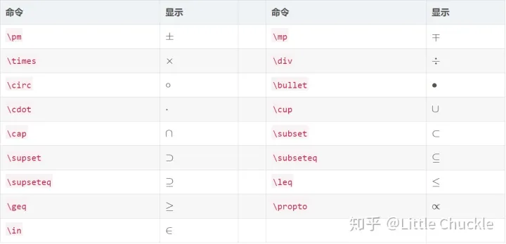

##前言：
本文是笔者在学习LaTeX的记录文档，主要是一些常用命令，笔者的感受是熟悉这些常用命令后即可上手编辑简单的论文，效率很高，体验比word好很多。命令不必全部记住，但是要知道能够实现哪些功能，并且能够检索到对应的命令。                                 
一、文本/排版：
1、定版型：
documentclass [A] {B}
A:①字体10pt(默认值)，11pt，12pt，例子：\documentclass[11pt]{article}；
②纸张大小有几个，最常见的就是a4paper，letterpaper(默认值)，例子：\documentclass[a4paper]{article}；
③单双面oneside(article,report默认值),twoside(book默认值)，例子：\documentclass[twoside]{article}；
④组合实现：\documentclass[a4paper,twoside,11pt]{article}顺序随意；

B：①常用：Article（英文科研文章）/report/book；②ctex文档类（支持中文）：ctexart/ctexrep/ctexbook；

2、加标题/日期/作者：

在\begin{document}之前输入：\title{标题}\author{作者}\date{日期} ； %输入空格即为空

在\begin{document}之前输入：\maketitle ； %输入后，前三者才生效

3、修改页边距:

\Usepackage{ geometry }；

\Gemometry(left=2.54cm,rught=2.54cm,top=3.09cm,bottom=3.09cm)； %A4版上下为 2.54厘米；左右为 3.09厘米

4、文本加粗： \textbf{ }；

5、左对齐： \noindent ； %本行左对齐不缩进

6、换行： \newline或者 \\；

7、空格： 单格\quad 双格\\quad；

8、居中/左对齐/右对齐：

①部分居中：

\centering； %小范围内(比如表格)居中后面部分内容

②全部居中/左对齐/右对齐：

\begin{center/flushleft/flushright}要居中的内容\end{center/flushleft/flushright }；

二、公式编辑（2-8均是在1的条件下使用）：

1、（1）行中插入公式： $公式$，例子：$\frac{L^4}{2}+\frac{L^3}{6}-\frac{4L}{3}$；

（2）行间插入公式（自动带上公式标号），\begin{equation}公式\end{equation}，

例子：\begin{equation}\frac{L^4}{2}+\frac{L^3}{6}-\frac{4L}{3}\end{equation}；

2、粗体（向量或矩阵）：用\mathbf{}（有时\textbf{}仍然有用）；

3、上标：字母^上标；下标：字母_下标；

4、括号：\left(括号内容\right) 或者直接输入（）；

5、分数：\frac{分子}{分母}；

6、求和：\sum_{下标}^{上标}；

7、符号(求余符号为\%)：

(1)希腊字母：

(2)基本运算符：

(3)积分运算符：

(4)其他符号：

