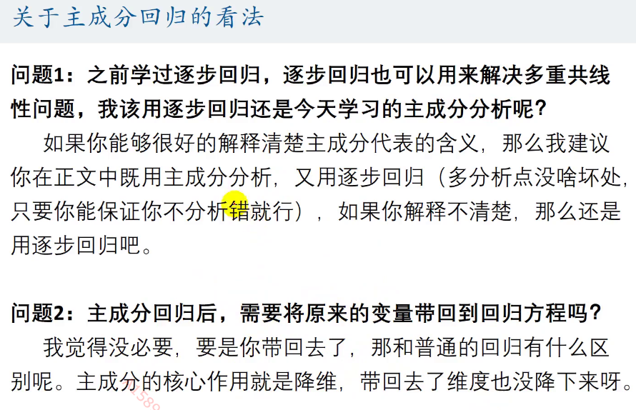

## 主成分分析
找到一组新的、低维变量，尽可能保留原有信息
### 数学思想
变量间往往存在线性相关，因此存在冗余信息，降维来去掉冗余信息，也就消去了线性相关。
### 应用
日常中最通俗的应用就是衣服的号码：人有肩宽、腰围、衣长，但是都可以用s、m、l、xl(号)/型来制作衣服，(号)/型就是衣服各种尺寸变量的主成分。
在科研中的研究，比如通过降维（可以使用主成分分析法）来让线性相关的变量，变的线性无关，就可以进行构造进行线性方程求解。
### 计算步骤
1. 先对n个样本、p个指标的n*p的样本矩阵x——进行标准化
2. 计算标准化后的样本矩阵的协方差矩阵=R（p*p）
3. 计算R的特征值和特征向量
4. 计算主成分贡献率和累计贡献率
贡献率=$\frac{\lambda_i}{\sum_{k=1}^p \lambda_k}$
累计贡献率=$\frac{\sum_{k=1}^i \lambda_k}{\sum_{k=1}^p \lambda_k}$
5. 写出主成分
一般取累计贡献率超过80%的特征值所对应的第一第二、...、第m（m<=p）个主成分
$F_i = a_{1,i} X_1+ a_{2,i}X_2 + a_{3,i}X_3+ ... + a_{p,i}X_p（i=1,2,...,m）$

6. 根据系数分析主成分代表的意义
主成分的$ a $越大，该指标影响越大
7. 利用主成分的结果进行后续分析
   (1) 不能作为评价类模型（借助6. ）
   (2) **可以作为聚类分析**
   (3) ** 可以用于回归分析**
### 对PCA进行分析
- 我们很难给主成分指标进行解释
- 主成分分析的难点在于，如何给主成分的指标进行解释
