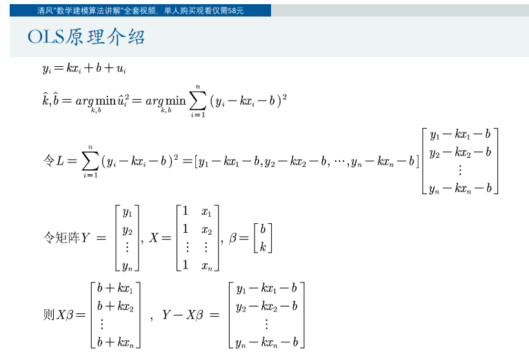
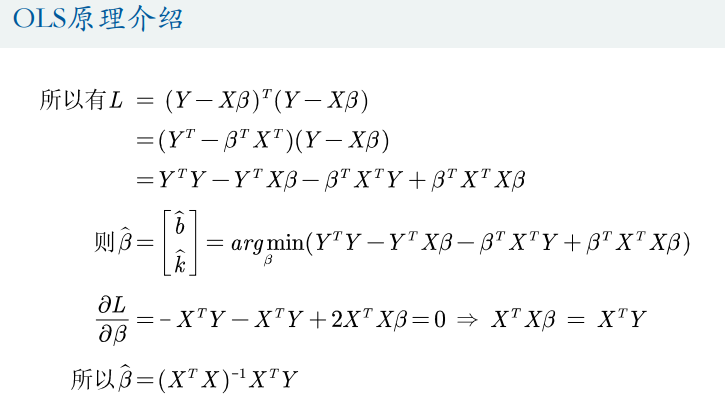
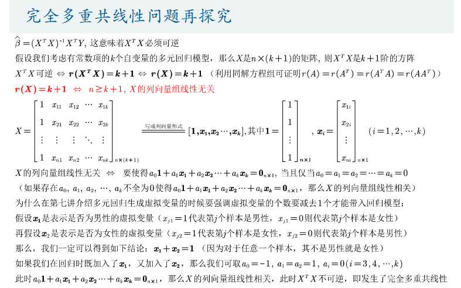
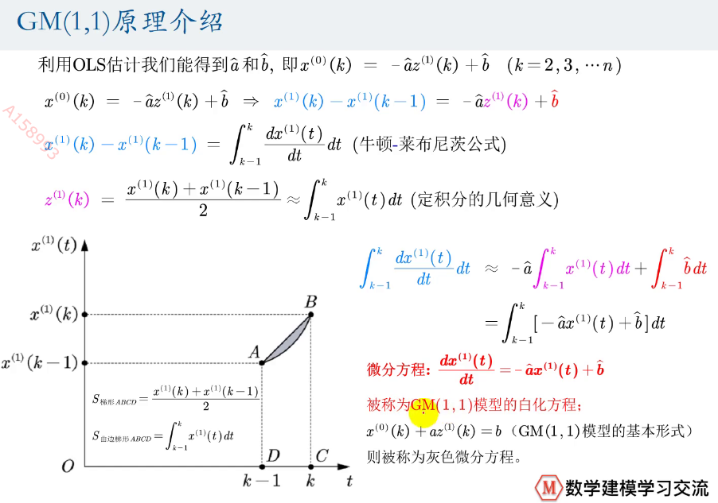
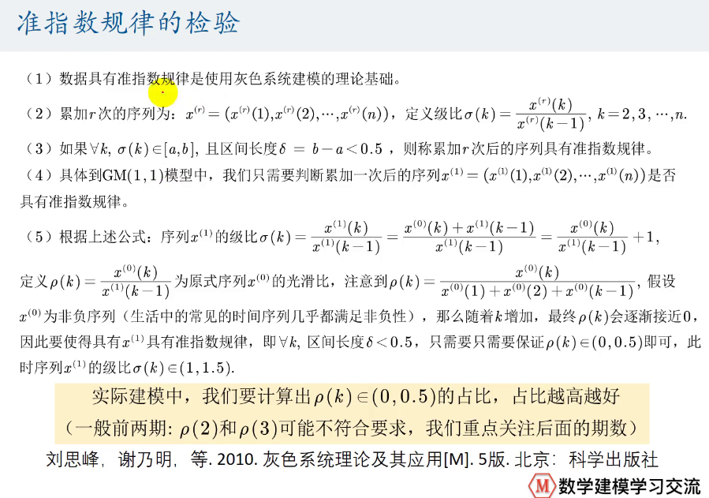
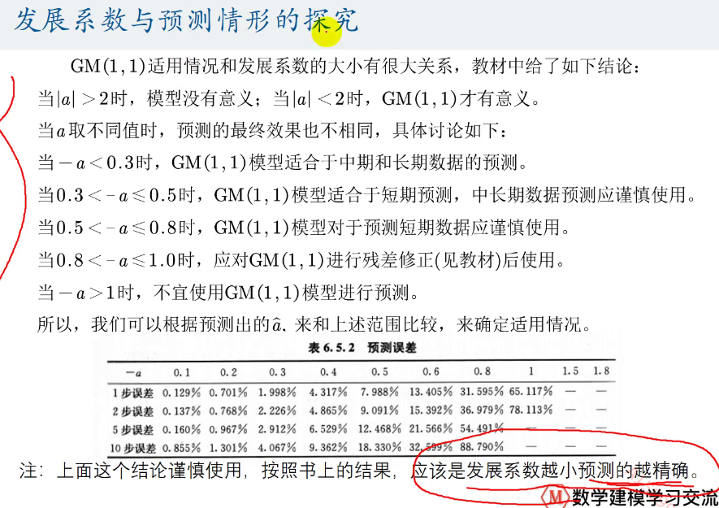
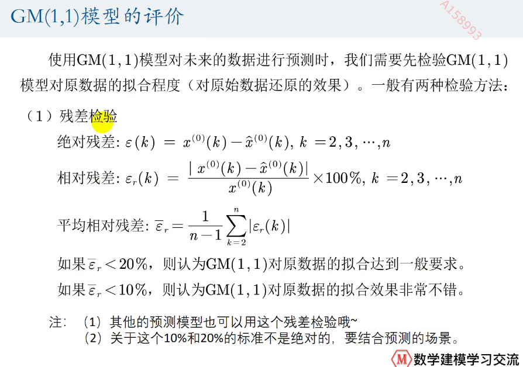
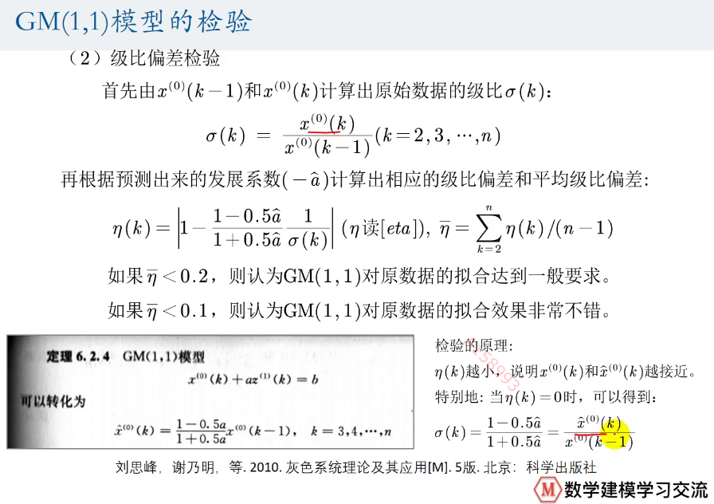
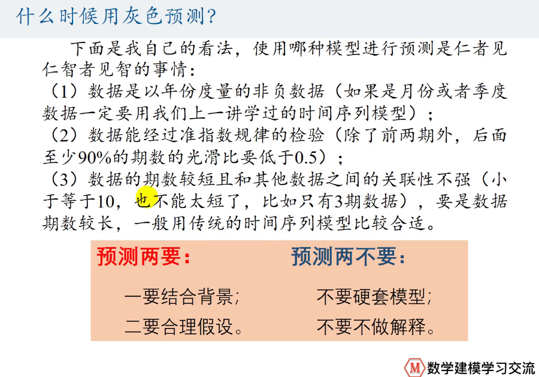

### 灰色预测
灰色预测是对既含有已知信息又含有不确定信息的系统进行预测，就是对在一定范围内变化的、与时间有关的灰色过程进行预测。
灰色预测对原始数据进行生成处理来寻找系统变动的规律，并生成有较强规律性的数据序列，然后建立相应的微分方程模型，从而预测事物未来发展趋势的状况.
#### OLS（补充知识）

（矩阵求导）

#### GM(1,1)grey model
GM(1,1)是使用原始的离散非负数据列，通过一次累加生成削弱随机性的
较有规律的新的离散数据列，然后通过建立微分方程模型，得到在离散点处的
解经过累减生成的原始数据的近似估计值，从而预测原始数据的后续发展。
- 全数据GM(1,1)
- 部分数据GM(1,1)
- 新信息GM(1,1)
- **新陈代谢GM(1,1)**

