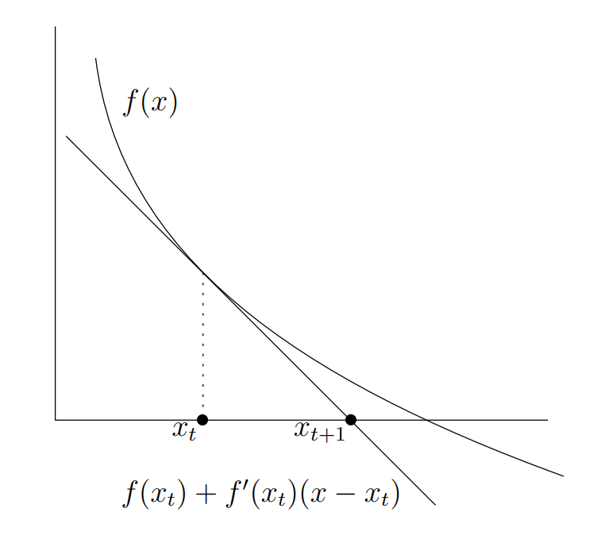
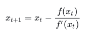
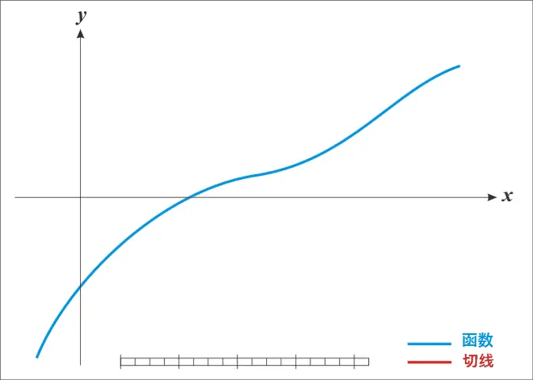

### [牛顿法求解方程近似解](https://zhuanlan.zhihu.com/p/293951317)

牛顿-拉夫逊（Newton-Raphson method）方法，实际上是一阶泰勒级数的应用
$\displaystyle \sum _{n=0}^{\infty }{\frac {f^{(n)}(a)}{n!}}(x-a)^{n}$
当然，直观上的狡辩不能使人信服。我们可以尝试讲道理地说明一下牛顿法的合理性。将​ $f(x)$ 在迭代初值 $x_0$ ​处Taylor展开可得：

$ f(x)=f(x_0)+f'(x_0)(x-x_0)+o(|x-x_0|)\\$ 舍去高阶项，可得：

$f(x)=f(x_0)+f'(x_0)(x-x_0)\\$ 将零点 $x^*$ ​代入其中可得：

$f(x^*)=0=f(x_0)+f'(x_0)(x^*-x_0)\\$ 因此可得：

$x^*=x_0-\frac{f(x_0)}{f'(x_0)}\\$ 由于上式是舍去了高阶项后的近似，因此我们实际上并不能根据上式一步得到 $x^*$ ​。而要通过多步迭代，由此得到牛顿迭代方程：

$x_{t+1}=x_t-\frac{f(x_t)}{f'(x_{t})}\\$ 

#### 牛顿法与梯度下降法的比较
在求最优化问题时，我们要对$f'(x_0)$求零点，也就有了
$x_{t+1}=x_t-\nabla ^2f(x_t)^{-1}\nabla f(x_t)\\$ 发现它和梯度下降法有点像？我们可以看一下固定步长的梯度下降法：
$x_{t+1}=x_t-\gamma\nabla f(x_t)\\$
- 可以发现，这两个方法都是基于当前迭代点的梯度信息进行搜索方向的选择的，只不过梯队下降法是在梯度的反方向上进行线搜得到下一个迭代点，而牛顿法则是通过Hessian矩阵在梯度上进行线性变换得到搜索方向（甚至步长都不需要确定）。所以牛顿法对函数在迭代点处的信息利用更加充分，直观来看，相比于梯度下降法，函数足够正则的情况下牛顿法迭代得更加准确，收敛速率也会更快。
- 拿正定二次型作为例子，无论使用哪种方式确定步长的梯度下降法，只要Hessian矩阵的条件数比较大，梯度下降法的迭代序列会依赖于迭代初值的选取，有的迭代初值会使得迭代序列抖动地靠近最优点，有的则只需要一步就迭代到了最优点。
- 牛顿法来说，无论迭代初值如何选取，它在正定二次形上的迭代只需要一步。

- 但是明显的，计算量要明显比梯度下降法要大，所以在深度学习中一般不用

所有基于梯度的迭代方程可以写成如下的形式：

$x_{t+1}=x_t-H(x_t)\nabla f(x_t)\\$ 

其中​ $x\in\mathbb R^n,H(x_t)\in\mathbb R^{n\times n}$ 。

对于牛顿法来说，​ $H(x_t)=\nabla^2f(x_t)^{-1}$ 

对于梯度下降法来说，​ $H(x_t)=\gamma I$ 

可以看到，牛顿法 $H$ 的​是随着当前迭代点的变化动态变化的，因此，相比于梯度下降法，牛顿法具有更加灵活的迭代过程。有的书上直接说牛顿法就是“自适应的梯度下降法”。

#### 牛顿法是否能代替梯度下降法作为优化器?
深度神经网络解决的，实际上也是优化问题？
```深度神经网络解决一个关键问题就是优化问题，我们希望训练一个模型出来，无论我输入什么的数据，他的损失函数都是最小的。这就是我们深度学习或者说优化模型的关键。```
##### 梯度下降法弊端

假如梯度下降的当前点为 $x^{(0)}$ ，在当前点进行泰勒展开：

$f(x) \approx f(x^{(0)}) +(x-x^{(0)})^{T}g+\frac{1}{2}(x-x^{(0)})^{T}H(x-x^{(0)})$ 

其中 $g$ 是梯度， $H$ 是 $x^{(0)}$ 处的Hessian。我们使用梯度下降进行迭代，新的点 $x=x^{(0)}-\epsilon g$ , 代入上式得：

$f(x^{(0)}-\epsilon g)\approx f(x^{(0)})-\epsilon g^{T}g+\frac{1}{2}\epsilon^{2} g^{T}Hg$ 

由上式可见，当 $\frac{1}{2}\epsilon^{2} g^{T}Hg$ 太大时，梯度下降可能使函数值上升。以下两种情况可能造成 $\frac{1}{2}\epsilon^{2} g^{T}Hg$ 太大：

1. 学习率 $\epsilon$ 太大， $x^{(0)}-\epsilon g$ 冲过了 $f$ 极小值所对应的 $x$ 。
2. $f$ 在梯度方向的二阶导数 $g^{T}Hg$ 太大，即函数在 $x^{(0)}$ 处非常陡峭，即使一个小的学习率也使 $x^{(0)}-\epsilon g$ 冲过$f$ 极小值所对应的 $x$。
   
另外，在多维情况下，单个点处每个方向的二阶导数是不同的。当在某个方向的二阶导数很大，另一个方向的二阶导数很小时，例如像下图中的窄而陡峭的峡谷。由于峡谷壁非常陡峭（一阶导数小但二阶导数大，一阶导数随梯度下降增加速度快），梯度下降偏向在峡谷壁向左或向右方向下降，而不是从上往下往峡谷底部下降。同时，因为峡谷壁非常陡峭，每一次迭代都冲过了峡谷底部，因此下一次迭代时在对面的峡谷壁下降。梯度下降把时间浪费于在峡谷壁上来回下降，因此效率很低。


2. 牛顿法
2.1.  牛顿法的原理

    如果我们同时考虑利用二阶导数带来的信息来指导迭代，最简单的方法是牛顿法。牛顿法基于二阶泰勒展开来近似 $x^{(0)}$ 附件的 $f(x) $ :

    $f(x) \approx f(x^{(0)}) +(x-x^{(0)})^{T}g(x_{0})+\frac{1}{2}(x-x^{(0)})^{T}H(x_{0})(x-x^{(0)})$     式（2.1.1）       


    其中 $g$ 是在 $x^{(0)}$ 处的梯度， $H$ 是 $x^{(0)}$ 处的Hessian。假如迭代后的点 $x^{*}$ 为极小点, 则需满足以下条件：

    $g(x^{*})=0$ , 即梯度向量中所有元素为0。$H(x)$ 为正定矩阵，即确保 $x$ 附近的驻点 $x^{*}$ 为极小点。这是因为$H(x)$ 为正定矩阵，任意方向二阶导数 $ d^{T}Hd  >0$ （见1.3）。假如条件2已经满足，对式2.1.1两边取导，得：

    $g(x)\approx g(x_{0})+H(x_{0})(x-x_{0})$                                                                                    

    令 $g(x)=0$ 得：

    $x^{*}=x\approx x^{(0)} -H(x^{(0)})^{-1}g(x^{(0)})$ 

    即每一步的迭代为：

    $x^{k+1}=x^{(k)} -H(x^{(k)})^{-1}g(x^{(k)})$ 

2.2. 牛顿法的进一步分析

 当 $f$ 是一个正定二次函数时，牛顿法只需迭代一次就能跳到函数的极小点。证明如下：

假如$f$ 是一个正定二次函数，则 $f(x)=\frac{1}{2}x^{T}Qx+b^{T}x+c$ ,其中 $Q$ 为实对称正定矩阵。设迭代初始点为 $x^{(0)}$ 

可求得在 $x^{(0)}$ 处的梯度 $g(x^{(0)})=Qx^{(0)}+b$ ，在 $x$ 处的Hessian为$H(x^{(0)})=Q$

（标量对向量求导的方法可参考[4] ）

则迭代后点 $x^{(1)}=x^{(0)} -H(x^{(0)})^{-1}g(x^{(0)})=-Q^{-1}b$ 

而对于 $f$ , 由 $g(x)=0$ 可直接求得驻点 $x^{*}=-Q^{-1}b$ ，又因为 $H(x)=Q$ 为正定矩阵，所以 $x^{*}$ 为极小点。

由 $x^{(1)}=x^{(*)}$ 可知牛顿法只需迭代一次就能跳到函数的极小点。

        当f不是真正二次但能在局部近似为正定二次时，牛顿法需要多次迭代。
        迭代地更新近似函数和跳到近似函数的最小点可以比梯度下降更快地到达驻点。
        但牛顿法只在Hessian为正定矩阵时才适用，否则牛顿法会跳进鞍点或极大点。
        高维空间中鞍点的激增解释了为何在大多数情况下为何牛顿法无法成功取代梯度下降。[1]

3， 一个例子：线性最小二乘假设我们希望找到最小化下式的 $x$ 值：

$f(x)=\frac{1}{2}||Ax-b||_{2}^{2}$ 

3.1 梯度下降

首先，我们计算梯度 $▽_{x}f(x)=A^{T}Ax-A^{T}b$ ，然后运行以下算法：

1）将学习率 $\epsilon$ 和容差 $\delta$ 设为小的正数。
2）while $||A^{T}Ax-A^{T}b||_{2}>\delta$  do

$x\leftarrow x-\epsilon(A^{T}Ax-A^{T}b)$ 

end while

3.2 牛顿法

$f(x)=\frac{1}{2}||Ax-b||_{2}^{2}$ 

$=\frac{1}{2}（Ax-b)^{T}(Ax-b)$ 

$= \frac{1}{2}x^{T}A^{T}Ax-b^{T}Ax+\frac{1}{2}b^{T}b$ 

因为对于任意单位向量 $d$ ， $d^{T}A^{T}Ad>0$ ，所以 $f(x)$ 是形如2.2的正定二次型。其中 $Q=A^{T}A$ , $b=-A^{T}b$ ,故一次迭代后可得极小点 $x^{*}=(A^{T}A)^{-1}A^{T}b$ 

（欢迎转载，但请注明出处）