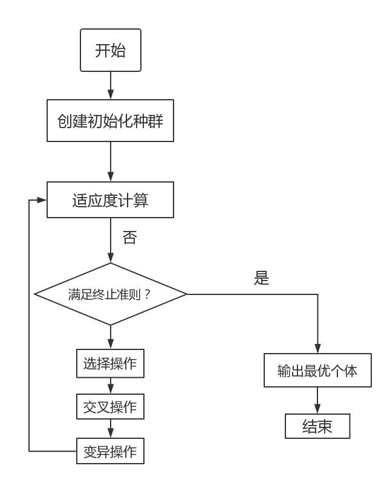

# Genetic Algorithm (GA,遗传算法)
### 1. 定义
遗传算法（Genetic Algorithm, GA）是模拟达尔文生物进化论的自然选择和遗传学机理的生物进化过程的计算模型，是一种通过模拟自然进化过程搜索最优解的方法。
____
#####主要特点
```
直接对结构对象进行操作，不存在求导和函数连续性的限定；
具有内在的隐并行性和更好的全局寻优能力；
采用概率化的寻优方法，不需要确定的规则就能自动获取和指导优化的搜索空间，自适应地调整搜索方向。
```
#####对象:
    一种群体中的所有个体
#####基本操作:
    选择、交叉和变异
#####核心内容
1. 参数编码
2. 初始群体的设定
3. 适应度函数的设计
4. 遗传操作设计
5. 控制参数设定
___
### 2. 常用词汇

#####基因型(genotype)
    性状染色体的内部表现。
    编码样式，把自变量转换为如二进制数串。
    方法有：二进制编码法、浮点编码法、符号编码法。

#####表现型
    染色体决定的性状的外部表现。
    自变量取值。

#####编码(coding)
    DNA中遗传信息在一个长链上按一定的模式排列。
    遗传编码可看作从表现型到基因型的映射。

#####解码(decoding)
    基因型到表现型的映射。

#####个体（individual）
    指染色体带有特征的实体。
    就是一个基因型的样本

#####种群（population）
    个体的集合，该集合内个体数称为种群。
    样本集合

#####适应度(fitness)
    度量某个物种对于生存环境的适应程度。
    评价指标函数

### 3. 形象理解
既然我们把函数曲线理解成一个一个山峰和山谷组成的山脉。那么我们可以设想所得到的每一个解就是一只袋鼠，我们希望它们不断的向着更高处跳去，直到跳到最高的山峰。所以求最大值的过程就转化成一个“袋鼠跳”的过程。

下面介绍介绍“袋鼠跳”的几种方式。

1. 爬山算法：一只袋鼠朝着比现在高的地方跳去。它找到了不远处的最高的山峰。但是这座山不一定是最高峰。这就是爬山算法，它不能保证局部最优值就是全局最优值。
2. 模拟退火：袋鼠喝醉了。它随机地跳了很长时间。这期间，它可能走向高处，也可能踏入平地。但是，它渐渐清醒了并朝最高峰跳去。这就是模拟退火算法。
3. 遗传算法：有很多袋鼠，它们降落到喜玛拉雅山脉的任意地方。这些袋鼠并不知道它们的任务是寻找珠穆朗玛峰。但每过几年，就在一些海拔高度较低的地方射杀一些袋鼠。于是，不断有袋鼠死于海拔较低的地方，而越是在海拔高的袋鼠越是能活得更久，也越有机会生儿育女。就这样经过许多年，这些袋鼠们竟然都不自觉地聚拢到了一个个的山峰上，可是在所有的袋鼠中，只有聚拢到珠穆朗玛峰的袋鼠被带回了美丽的澳洲。
### 4. 遗传算法的一般步骤
随机产生种群。
根据策略判断个体的适应度，是否符合优化准则，若符合，输出最佳个体及其最优解，结束。否则，进行下一步。
依据适应度选择父母，适应度高的个体被选中的概率高，适应度低的个体被淘汰。
用父母的染色体按照一定的方法进行交叉，生成子代。
对子代染色体进行变异。
由交叉和变异产生新一代种群，返回步骤2，直到最优解产生。
